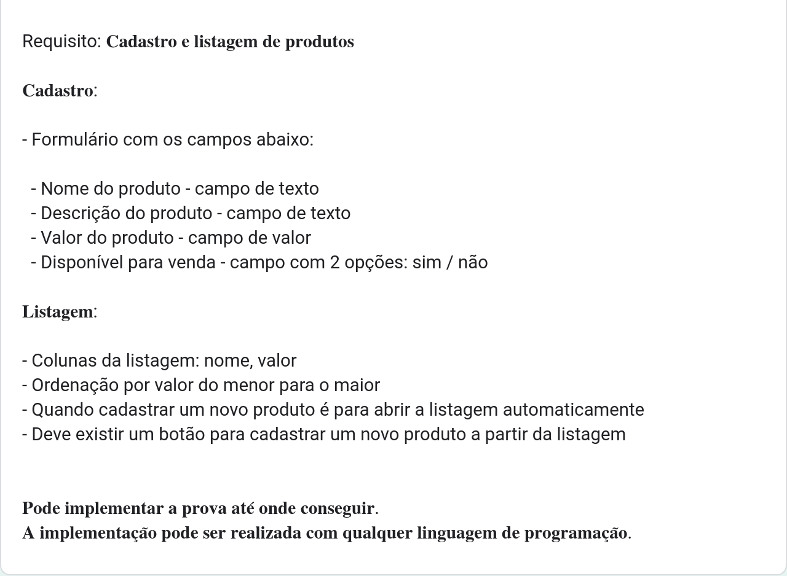

Desafio: Cadastro e Listagem de Produtos

Este projeto consiste em criar um sistema de cadastro e listagem de produtos utilizando Next.js. Abaixo está um exemplo visual de como deve ser a interface:

Este projeto foi desenvolvido como parte de um desafio para criar um sistema simples de cadastro e listagem de produtos utilizando Next.js. O objetivo foi implementar um formulário para adicionar novos produtos e uma tabela para listar os produtos cadastrados, com funcionalidades de ordenação por valor e opção de disponibilidade para venda.
Tecnologias Utilizadas

    Next.js
    React
    Axios (simulação de requisições HTTP para API local)
    Tailwind CSS (para estilização)

Funcionalidades Implementadas
Formulário de Cadastro

O formulário de cadastro foi implementado com os seguintes campos:

    Nome do Produto (campo de texto)
    Descrição do Produto (campo de texto)
    Valor do Produto (campo de valor numérico)
    Disponível para Venda (campo com opções: sim / não)

Listagem de Produtos

A listagem de produtos foi exibida em uma tabela com as seguintes colunas:

    Nome
    Valor

Funcionalidades Adicionais

    Ordenação por Valor: Os produtos foram listados em ordem crescente de valor.
    Abertura Automática da Listagem: Após cadastrar um novo produto, a listagem é atualizada automaticamente.
    Botão para Cadastro: Um botão na listagem permite adicionar um novo produto.

Simulação de Conexão com API Local

Para simular o backend, foi utilizado um arquivo local para armazenar os dados dos produtos. As operações de CRUD (Create, Read, Update, Delete) foram simuladas utilizando Axios para realizar requisições HTTP.
Estrutura do Projeto

API de Produtos

Este projeto utiliza uma API simples para gerenciar produtos, com rotas configuradas usando Next.js. As operações disponíveis são listagem de produtos e cadastro de novos produtos.
Rotas
GET /api/produtos

    Retorna a lista de produtos cadastrados.

Exemplo de uso:

bash

curl http://localhost:3000/api/produtos

POST /api/produtos

    Cadastra um novo produto com base nos dados fornecidos no corpo da requisição.

Como Executar o Projeto

    Clone este repositório.
    Instale as dependências usando npm install ou yarn install.
    Inicie o servidor de desenvolvimento com npm run dev ou yarn dev.
    Acesse o aplicativo no seu navegador através de http://localhost:3000.

Este README fornece uma visão geral do projeto, explicando as tecnologias utilizadas, as funcionalidades implementadas e como executar o projeto localmente. Certifique-se de ajustar os detalhes conforme necessário para refletir fielmente o seu projeto específico e suas implementações.

